# BlockChain Account Management

It is Decentralized open source App (Dapp) built on Ethereum platform. It help in managing multiple accounts.

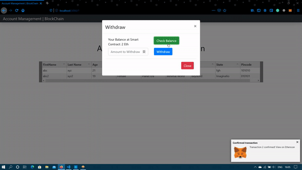 

## Features

- Deposit ETH to the Smart Contract and withdraw them later.
- Transfer ETH to an address.
- Check for the balance on the smart contract.
- Get all registerd user's information.
- It allows the user's to update there account later.

## Installation

### Installing the prerequisite

- Install **Ganache** from [here](https://www.trufflesuite.com/ganache), run it and create a quickstart project. This will create a personal local block chain.
- Install **[MetaMask](https://metamask.io/)** extention to your browser. This will help your browser to connecting with the block chain and also act as a Wallet.

### Compiling and running the project

- Clone this project.
- Install dependencies `npm install`
- Compile solidity files. `truffle compile`
- Deploy files to blockchain `truffle deploy` (_Make sure Ganache is running_)
- Run the program `npm run start`.
- `localhost:3000` will open in your browser.
- The page will prompt to login to metamask
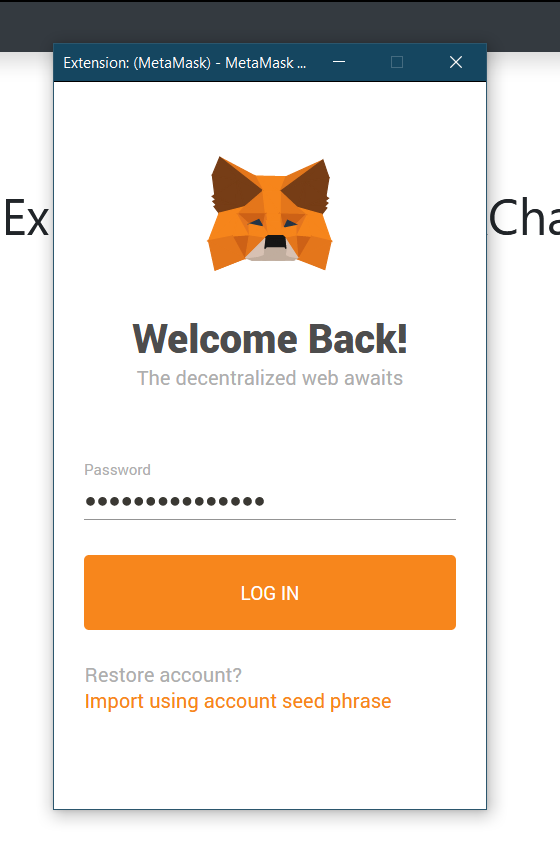 

### Adding and Connecting to Ganache

- Now, we need to connect metamask to our blockchain, which we have creted by running Ganache.
- To do that, click on metamask extention select on `Ropsten Test Network`. From the drop down click on `Custom RPC`.
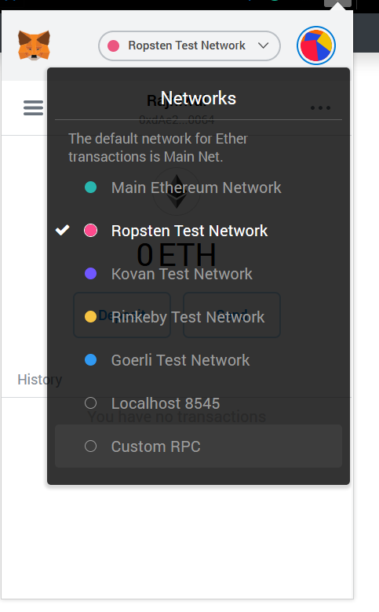 

- Enter network name as `Test` and RPC URL as `http://127.0.0.1:7545`
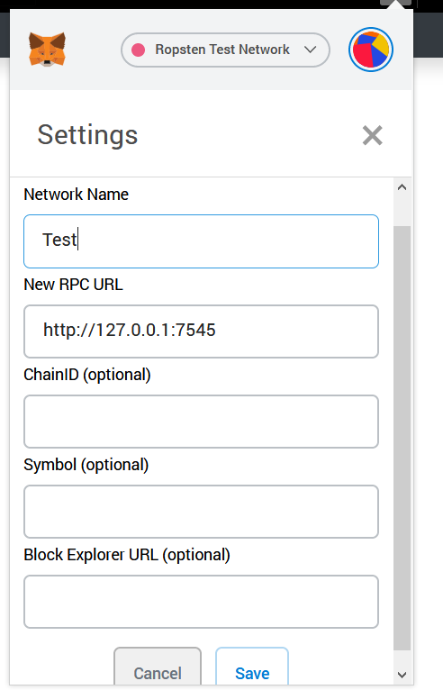 

### Importing Accounts

- Now we are connected to the network. It's time to import accounts, which have fake ETH.
- Ganache create _10_ Accounts with _100ETH_ as inital ammount.(These are fake and will run only on your Testing Blockchain).
- Select any account and click on key to get private key.
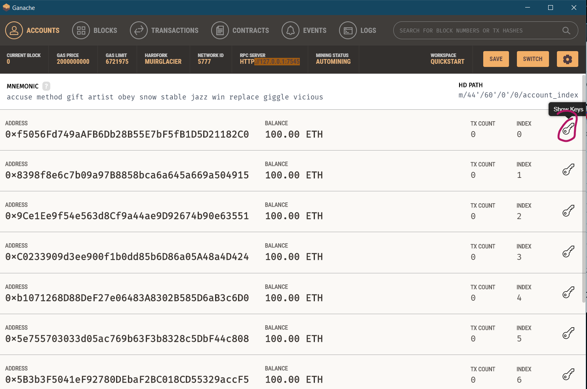 

- Copy private key. 
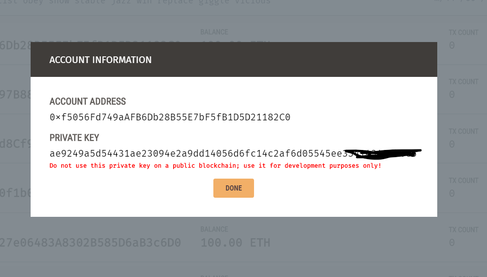 

- Go back to your browser. Select metamask extention and click on top-right circle to open account panel and then select `Import Account`. 
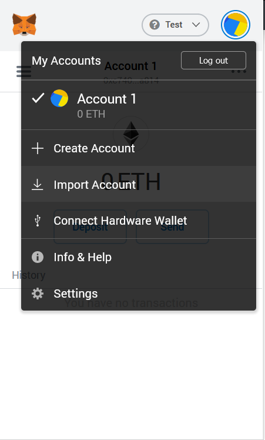 

- Paste your private key and click Import.
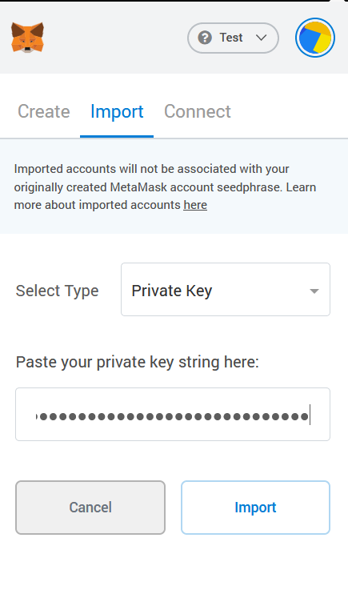 

- You will see 100ETH in the account, as sign of success. 
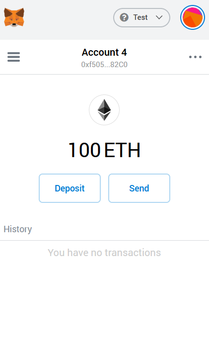 

- You can fetch other accounts, similarly.

## Understanding The Interface

The interface shows the total user who have registered with the service with there data store in the smart contract.

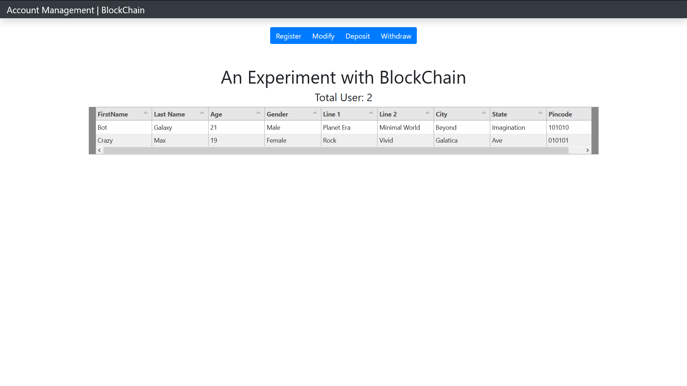 

- **Register:** It will create a new account on the smart contract with the mentioned parameters.
  1. First Name
  2. Last Name
  3. Age
  4. Gender
  5. Address _(Line1, Line2, City, State, Pincode)_
  
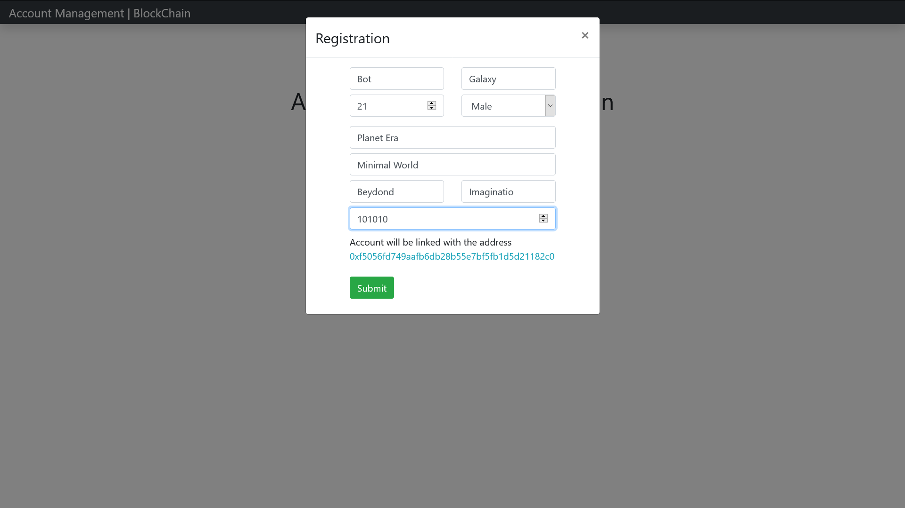 

> Note: Registration data will be linked with the Account selected in Metamask.

- **Modify:** It let you to update your account details, if you have registered. The selected metamask account will be use for verfication.
- **Deposit:**

  1. Transfer ETH to smart contract (i.e. to self). You only need to provide ETH value field, address field is not required for this.
  2. Transfer ETH to other account on blockchain. Address field and value field both are mandatory.
  
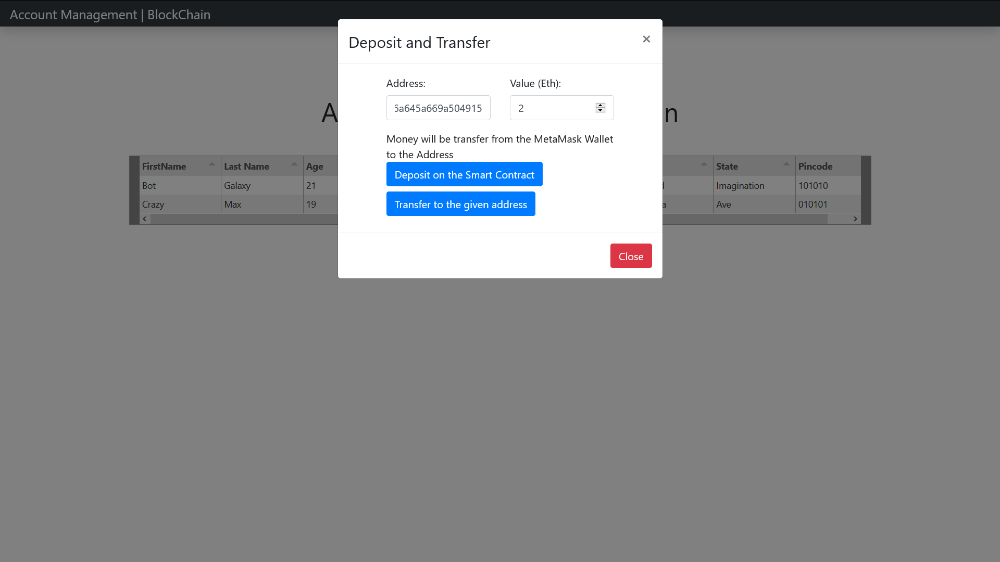 

> **Deposit on the Smart Contract** => Don't require address field.
> **Transfer to the given address** => Require Both field.
> _All ETH transfer is done from the wallet._

- **Withdraw:**
  1. Check your balance in the smart contract.
  2. Withdraw ETH from smart contract.(If you have submitted any).
  
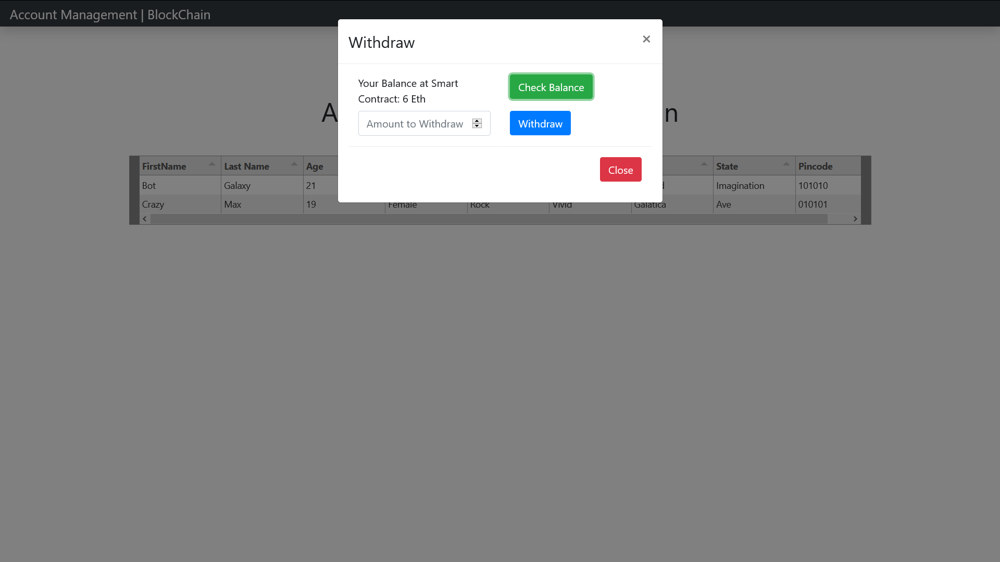 

